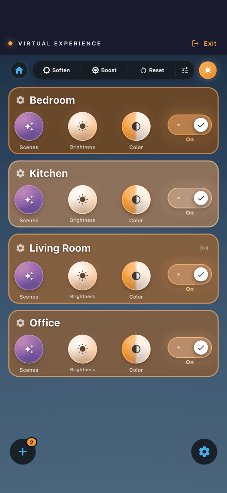
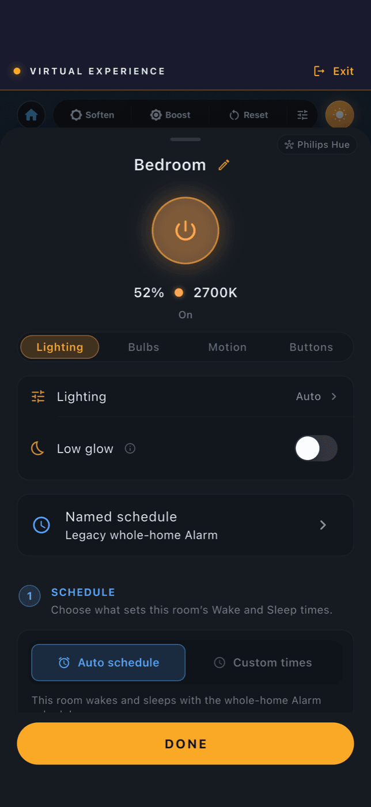
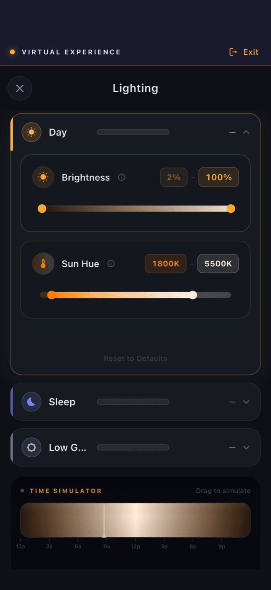
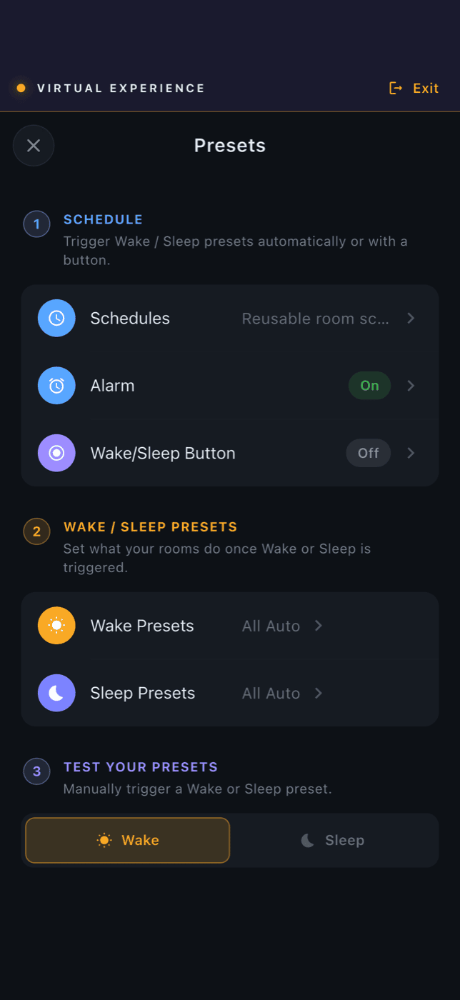
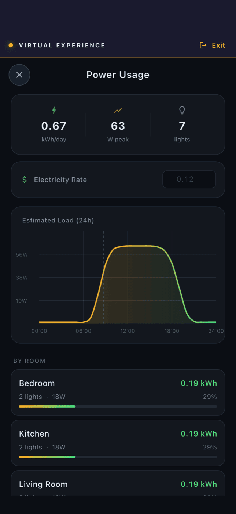

<p align="center">
  
</p>

<h1 align="center">Rhythm OS</h1>

<p align="center">
  <strong>Light done right.</strong><br>
  An open-source lighting engine that gives every room the right light, all day, with nothing to configure.
</p>

<p align="center">
  <a href="LICENSE"></a>
  <a href="https://github.com/sticktrk/rhythm-os/actions/workflows/ci.yml"></a>
  <a href="https://apps.apple.com/us/app/rhythm-lighting/id6758312802"></a>
  <a href="https://discord.gg/8DXG3WjA"></a>
  <a href="https://rhythm.lighting/rhythm-os">rhythm.lighting/rhythm-os</a>
</p>

---

Your home is already talking in light. It is just saying the wrong thing at 11pm.

You have felt it: wired at midnight, mornings that start slow, a living room that feels like an office at nine at night. You can feel wrong light. You should not have to spec right light.

Rhythm OS is the interpreter. It runs one continuous curve for the whole day, sun by day and fire at night, and keeps every light in the house on it. Clear in the morning. Warm in the evening. Low when it is time to let go. Out of the box, every room already knows what to say.

<p align="center">
  
</p>

## Not another scene menu

Home Assistant, Homey, and Hubitat are excellent at giving you control: sixteen million colors, scenes, schedules, automation rules. That hands the hardest question to the person least equipped to answer it. What light do you actually want at 7:40 on a Tuesday evening?

Rhythm ships the answer instead.

- **One day, one curve.** No modes, no scene names, no timers. The day is the interface.
- **Right when you walk in.** Press a button and the room comes on at the value the curve says it should be right now.
- **Dimming that means something.** Up and down move you along the curve, not to arbitrary percentages.
- **The veto is yours.** Need more light to cook? Take it. No menu, no negotiation. The rhythm picks itself back up when you are done.
- **Local, calm, private, immediate.** It runs in your house. No cloud in the loop, no subscription. The sun does not have outages.

## What it looks like

The app is where you meet the default: it shows what your home is saying, and takes the override when life disagrees. Scrub the time simulator to any hour of the day and preview it on the real lights. Like where the evening landed? Absorb it, and the curve remembers.

<p align="center">
  
  &nbsp;
  
  &nbsp;
  
  &nbsp;
  
</p>

<p align="center"><sub>Screens from the built-in Virtual Experience. Open the app and tap <em>Try a Virtual Experience</em> to walk the same home with no hardware.</sub></p>

## Works with your lights

Rhythm speaks to whatever you already own, and gives it all one language.

| Your lights | How Rhythm reaches them | Status |
| --- | --- | --- |
| **Philips Hue** | Bridge takeover over the V2 API, including buttons and motion sensors. Bridgeless Hue bulbs directly over Bluetooth. | Shipping |
| **Matter** (Thread and Wi-Fi) | Rhythm is its own Matter commissioner. Any Matter bulb, any brand, no extra hub. | Shipping |
| **Home Assistant** | Any HA light entity: Zigbee, Z-Wave, Wi-Fi. Run Rhythm as an add-on and keep everything else in HA. | Shipping |
| **Bluetooth buttons and sensors** | Shared local BLE runtime with versioned device profiles. | Shipping |
| **Zigbee direct** | Native coordinator crate is designed and on the roadmap. Today, Zigbee reaches Rhythm through Home Assistant. | Planned |

Every bulb is checked against a capability database of known models, so a command is fitted to what that bulb can actually do: its kelvin range, its color gamut, its quirks. Warm-to-cool whites, color bulbs, plain dimmables, strips, switches, motion sensors.

## What the server does

Everything below runs on-box, in Rust, with the same REST and SSE surface on every target. Columns show where each capability is available: the macOS/Linux server, the Raspberry Pi Zero appliance, and the Home Assistant add-on.

| Capability | What it means | Server | Pi Zero | HA add-on |
| --- | --- | :-: | :-: | :-: |
| **The curve** | | | | |
| Solar-shaped day curve | Brightness and color temperature as one continuous function of the sun at your location | ● | ● | ● |
| Pluggable profiles | Day, Sleep, and Low glow ship built in; any shape via the `LightProfileModule` trait | ● | ● | ● |
| Curve-relative dimming | Up and down step along the curve instead of jumping to a percentage | ● | ● | ● |
| Time offset and absorb | Shift a room earlier or later; fold the shift into the curve permanently | ● | ● | ● |
| Minimum brightness floor | A pre-dawn floor so early mornings never start at zero | ● | ● | ● |
| Curve preview and solar context | Read the curve for any time, plus sunrise, sunset, and twilight | ● | ● | ● |
| **Rooms and control** | | | | |
| Rooms and topology | Create, rename, merge rooms; move devices between them | ● | ● | ● |
| Canonical devices and triage | One identity per physical device across hubs; a triage queue for merge decisions | ● | ● | ● |
| Buttons | On, off, toggle, step up and down, hold to dim, sleep, reset. Multi-press sequences on Hue | ● | ● | ● |
| Motion | Motion-triggered rooms with per-room timeouts | ● | ● | ● |
| Override that resumes | Manual brightness or color holds, then the room rejoins the rhythm | ● | ● | ● |
| Day and Sleep modes | Two modes, transitions with triggers and durations, wake and sleep presets per room | ● | ● | ● |
| Scenes | Stored scenes with preview, commit, and whole-home apply with paced dispatch | ● | ● | ● |
| Low glow and power-save | Standby lighting and idle behavior per room | ● | ● | ● |
| Light breaker | One global switch that takes all autonomous control offline | ● | ● | ● |
| Per-device capability fitting | Commands adapted to each bulb's real kelvin range, gamut, and quirks | ● | ● | ● |
| **Lights** | | | | |
| Philips Hue bridge | V2 API, SSE events, buttons, motion, grouped lights | ● | ● | ● |
| Hue Bluetooth bulbs | Direct control, no bridge | ● | ● | ○ |
| Matter commissioning | Thread and Wi-Fi bulbs, native CHIP daemon, no extra hub | ● | ● | ● |
| Home Assistant entities | Any HA light, ZHA events | ● | ● | ● |
| Bluetooth buttons and sensors | Shared BLE runtime with versioned device profiles | ● | ● | ○ |
| Bulb Audition | Automated control-profile test with a typed report | ● | ● | ● |
| **Runtime** | | | | |
| REST API + SSE events | Full control and a live event stream on port 54448 | ● | ● | ● |
| Selective state reads | Fetch only the state slice you need, with receipts | ● | ● | ● |
| Non-blocking hub dispatch | Per-hub mailboxes, latest-wins, pacing, timeouts, cooldowns | ● | ● | ● |
| mDNS discovery | Apps find the box on the LAN, no IP typing | ● | ● | ● |
| HA ingress and Supervisor auto-config | Zero-config inside Home Assistant | ○ | ○ | ● |
| **Ownership and safety** | | | | |
| Device claim and auth | The box belongs to one account; API auth middleware | ● | ● | ● |
| Remote access | Tunnel bundled and switchable from the app | ○ | ● | ○ |
| Backup and restore | Whole installation as one file | ● | ● | ● |
| Profile bundle export | Portable profiles, transitions, and power-save settings | ● | ● | ● |
| Factory reset | Back to shipped defaults | ● | ● | ● |
| Over-the-air updates | Beta and stable channels, A/B rootfs slots, fingerprint gate, quiet update window | ● | ● | ○ |
| BLE Wi-Fi provisioning | First-boot setup from the phone, recovery when the network changes | ○ | ● | ○ |
| Debug bundle and flight recorder | One call collects logs and host telemetry for support | ● | ● | ○ |
| Assistant contract | Machine-readable contract and topology for LLM and automation clients | ● | ● | ● |

● available · ○ not on this target. The HA add-on leaves updates, Bluetooth, and remote access to Home Assistant itself.

## Rhythm vs. general-purpose hubs, for lights

Rhythm does one thing. It is not a replacement for Home Assistant, Homey, or Hubitat if you also want to automate your garage door. For lighting alone, this is the difference:

| | Rhythm OS | Home Assistant | Homey | Hubitat |
| --- | --- | --- | --- | --- |
| Circadian light out of the box | Yes, it is the default | Add-on or blueprint, you configure it | Flow you build yourself | Community app, you configure it |
| Configuration required to get right light | None | Significant | Moderate | Moderate |
| Dimming follows the daily curve | Yes | No, percentages | No, percentages | No, percentages |
| Override resumes on its own | Yes, by design | You script it | You script it | You script it |
| Local only, no cloud dependency | Yes | Yes | Partly, cloud-tied | Yes |
| Matter commissioning built in | Yes, no extra hardware | Yes | Yes (Pro) | Yes (C-8 line) |
| Hue buttons and motion, bridge takeover | Yes | Via integration | Via integration | Via bridge integration |
| Runs on | Pi Zero, macOS, Linux, HA add-on | Pi 4 and up, x86 | Homey hardware | Hubitat hardware |
| Device breadth beyond lighting | None | Enormous | Large | Large |

If you already run Home Assistant, you do not have to choose. Install Rhythm as an add-on and let it own the lights.

## Get started in five minutes

**Raspberry Pi Zero appliance.** Flash the image, power it on, and pair it from the app over Bluetooth. It joins your Wi-Fi and finds your lights.

```bash
curl -L https://dl.rhythm.lighting/server/sdcard.img.gz | gunzip > sdcard.img
```

**Home Assistant add-on.** Add the repository in the add-on store, install Rhythm, open it through ingress. It auto-configures from the Supervisor. See [os/install/addon](os/install/addon/README.md).

**macOS or Linux, from source.**

```bash
cargo build -p rhythm-server --release
./os/install/install.sh
```

Then install the [Rhythm app](https://apps.apple.com/us/app/rhythm-lighting/id6758312802). It finds the box over mDNS. To look around before you own any hardware, tap **Try a Virtual Experience** on the first screen for a fully simulated home.

Details for every platform live in [os/install](os/install/) and the [local development quickstart](docs/development.md).

## Dependable on purpose

The benefit of right light is that it is right every time, until your body starts counting on it. That makes reliability doctrine, not a feature bullet.

- **Non-blocking dispatch.** Every hub gets its own mailbox with latest-wins coalescing, pacing, supervised timeouts, and per-target cooldowns. One slow bridge never stalls the house.
- **Over-the-air updates** with A/B root filesystem slots, a fingerprint gate, and a quiet daily update window. A bad update rolls back.
- **Backup, restore, factory reset.** Your whole installation exports as one file. Profiles and transitions travel as a portable bundle.
- **Recovery baked in.** BLE Wi-Fi provisioning, a host flight recorder, and one-call debug bundles when something does go wrong.

## The graduate layer

Most people never open the settings and lose nothing. If you come to speak light yourself, everything is tunable, and tuning feels like tuning an instrument.

- Shape the curve in the designer: wake, peak, wind-down, and the minimum brightness floor before dawn.
- Per-room profiles. A bedroom can run a sleep curve while the kitchen runs the day.
- Day and Sleep modes with configurable transitions and triggers.
- Button bindings for every action: toggle, step along the curve, hold to dim, sleep on and off, reset.
- Motion timeouts per room. Power-save. A light breaker that takes the whole system offline in one switch.
- An energy view that estimates kWh from the curve and your bulb wattage.

## For builders

Rhythm is a layered set of Rust crates with a clean contract at every seam. Bring your own frontend, your own curve, or your own lighting product.

- **REST + SSE.** Every platform exposes the same API. Full state snapshots, selective reads, and a real-time event stream for room state, motion, hub status, dispatch failures, and pairing progress. See the [API reference](os/CLAUDE.md#api-endpoints).
- **Pluggable curve engine.** Implement `LightProfileModule` and the whole system runs your shape. The Gaussian solar default is just the one that ships.
- **Add a lighting product in one crate.** Implement `LightController`, `HubRegistry`, `HubProvider`, and event translation. No changes to the core. Contract and template in [os/INTEGRATIONS.md](os/INTEGRATIONS.md).
- **Dart SDK.** Typed models, SSE with polling fallback, pairing, OTA, diagnostics. Powers the Flutter app and available as [`rhythm_sdk`](sdk/).
- **Assistant contract.** A machine-readable [contract](docs/architecture/light-assistant-contract.md) and topology endpoint so LLM and automation clients can drive lights without overstepping the user's authority.
- **Flutter app.** iOS, macOS, Android, and web. Runs against a real server or a simulated home. See [app/](app/).

```
┌─────────────────────────────────────────────────────────┐
│  Binaries        rhythm-server · rhythm-linux-appliance  │
│                  rhythm-addon                             │
├─────────────────────────────────────────────────────────┤
│  OS layer        rhythm-os  (rooms, events, commands)    │
├─────────────────────────────────────────────────────────┤
│  Integrations    rhythm-hue · rhythm-ha · rhythm-matter  │
│  Protocols       rhythm-ble · (rhythm-zigbee, planned)   │
├─────────────────────────────────────────────────────────┤
│  Core            rhythm-core  (solar, curves, color)     │
│                  rhythm-profile · rhythm-devices          │
└─────────────────────────────────────────────────────────┘
```

Read the [server guide](os/README.md) for the crate-by-crate tour.

## Repository map

| Directory | Purpose |
| --- | --- |
| `os/` | Server, device integrations, and appliance packaging |
| `app/` | Flutter mobile, desktop, and web app |
| `sdk/` | Dart client SDK |
| `runtime/` | Rust runtime API and modules |
| `protocol/` | Shared protocol documentation and contracts |
| `tools/app/supabase/` | Optional product database schema and Edge Functions |
| `admin-api/`, `admin-ui/` | Optional staff administration source; requires your own authorized backend |
| `lab/` | Hardware test tooling and synthetic fixtures |
| `docs/` | Architecture and backend documentation |

This repository preserves a privacy-filtered development history. Private marketing systems, customer investigation material, production environment files, and internal operational automation are excluded. See [public history](docs/public-history.md).

Run the portable repository checks from the root:

```bash
./tools/check-repo-invariants.sh
```

## Community, contributing, security

- [Discord](https://discord.gg/8DXG3WjA) for help, setups, and feature discussion.
- [GitHub Issues](https://github.com/sticktrk/rhythm-os/issues) for bugs and requests. Please keep raw customer logs, support bundles, credentials, and customer identifiers out of public issues.
- [CONTRIBUTING.md](CONTRIBUTING.md) for how to submit changes. [SECURITY.md](SECURITY.md) for private vulnerability reporting.

## License

First-party code is licensed under [Apache-2.0](LICENSE). Third-party components retain their own licenses and attribution notices. See [NOTICE](NOTICE).

---

<p align="center">Light is language. Rhythm makes it fluent.</p>
